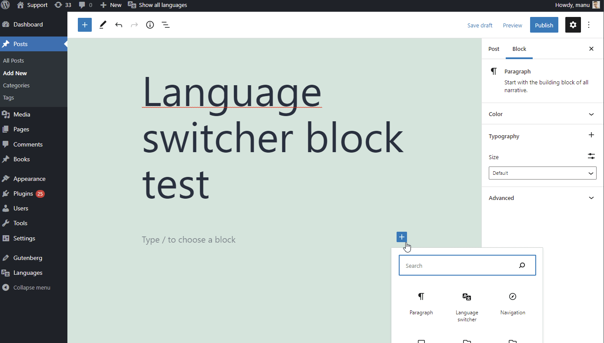
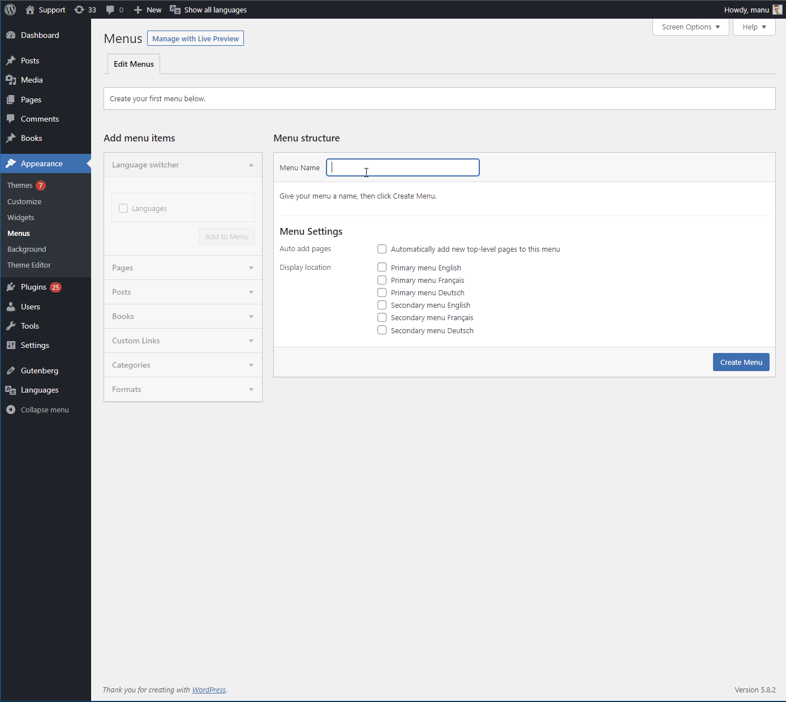
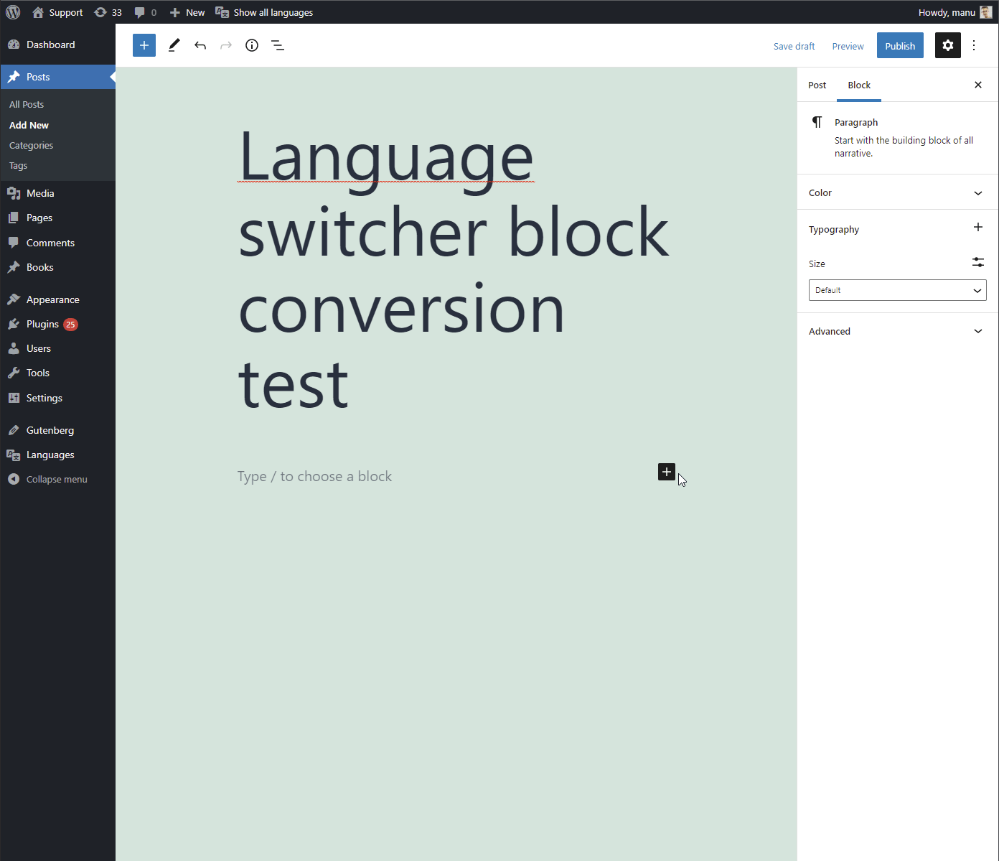
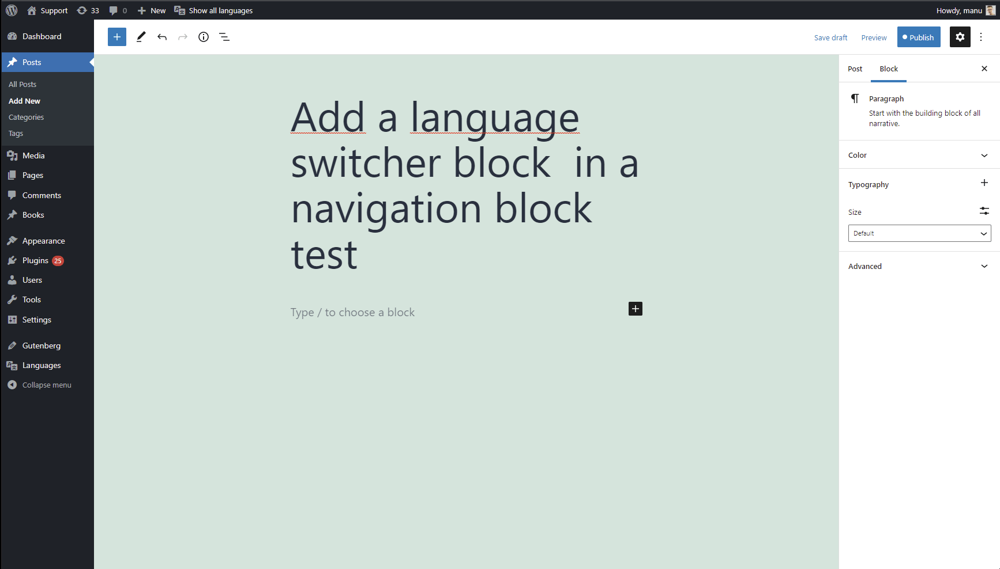

# gutenberg-block-navigation-conversion-test

The code is based on Polylang Pro and need Polylang is installed and activated to work.

This an example of a custom menu item (Language switcher) that needs to be converted in its corresponding `polylang/navigation-language-switcher` block.

It is a base to test the issue in the Gutenberg project.

## Requirements
- [Polylang plugin](https://wordpress.org/plugins/polylang/) 3.1.2 (latest version)
- WordPress 5.8.2 or later
- Gutenberg 12.0.x or later
- A classic WordPress theme like Twenty Twenty-one

## How to use

Simply put in your `wp-content/mu-plugins/` folder of your WordPress instance:
1. the `block-editor-switcher-block.php` and `gutenberg-block-navigation-conversion-test.php` files
2. the `dist/` folder
3. create a new post by using the block editor
4. See you can add the language switcher block and the navigation block

## How to test the language switcher
1. Go to Languages
2. Create two languages: English as the default one and French for example
3. Create a new post Posts > Add New
4. Add a language switcher block
5. Play with the language switcher block attributes and see the block WYSIWYG rendering. NB: some of them have no effects because it depends on the frontend context: `Hides languages with no translation` for example

## How to test the language switcher conversion with the navigation block from an existing menu
1. Follow the first two steps in the first case above
2. Go to Appearance > Menus
3. Create a classic menu named `Main` for example and checked the theme location Primary menu English. It's sufficient for testing the classic menu conversion
4. Add the language switcher in the menu as it's explained in the Polylang documentation https://polylang.pro/doc/the-language-switcher/#ls-in-menu. Ensure that you can add the language switcher by refering to the Polylang FAQ https://polylang.pro/doc/i-cant-add-the-language-switcher-in-the-menus/ and verifying the WordPress screen options.
5. Check the language switcher `Display flags` option
6. Add another page for example in the menu
7. Save the menu

8. Create a new post by using the block editor
9. Add a navigation block
10. Select the `Main` menu from the Classic menus list
11. See the language switcher is correctly coverted to its corresponding block however the flags aren't rendered and the `Display flags` block attribute isn't checked as it should and as it has been checked previously in the `Main` classic menu.

## How to use the language switcher with the navigation block
1. Follow the first two steps in the first case above
2. Create a new post by using the block editor
3. Add a navigation block
4. Click on `Start empty`
5. Add a page link in the navigation block
6. Transform it as a language switcher block and check its `Display flags` attribute
7. Add a page link again to complete the navigation block

